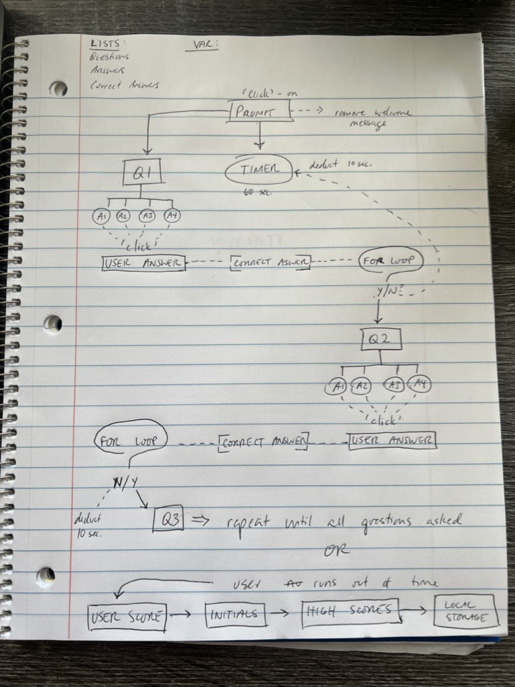

# Code-Quiz

## Project Description:
The task for this homework assignment was to create a quiz where the user must start by clicking a button to trigger a timer and the first question. The user can pick from one of 4 answer choices and if they are correct they move forward to the next question with no penalty. If the user is incorrect, 10 seconds is deducted from the timer and they move forward to the next question. After the user has answerered all 5 questions, or they have run out of time, they are prompted to insert their initials for a high scores list tracker.

I was able to accomplish most of this task using jQuery, however, I fell short in my for loops for comparing the user answers with the correct answers and therefore my 10 second penalty deduction is faulty. Furthermore, I was not able to track the user scores and then prompt the user to input their initials for their high score.

In conclusion, I plan on submitting this incomplete quiz now for a grade and come back to it later to finish it and resubmit.

#### You can access this project via [GitHub](https://github.com/BrianLalli/Code-Quiz)

 

## Wireframe:

 

## Pseudo-Code:
* List of questions, potential answers, and correct answers
* Landing page with start button
* Add event listener to start quiz/timer
* User answer question
* Read chosen element, assess data value, compare to answer key
* Conditional if else statement to check if user answer is correct or incorrecy
* If incorrect deduct 10 seconds from timer
* End of quiz
* Add up user score
* Display input for my user to type their initials
* Second html and display user name and score
* Read object from local storage

 

## Credits:
[Chelsea Sexton](https://github.com/chelsea314)
[Andrew Edwards](https://github.com/Andrew87E)
[Sara Baqla](https://github.com/missatrox44)

 

## Sources:
[W3](https://www.w3schools.com/jsref/met_win_setinterval.asp)

[jQuery](https://api.jquery.com/removeclass/)

[Mozilla](https://developer.mozilla.org/en-US/docs/Web/JavaScript/Reference/Global_Objects/Array)

CSS Styling by: [Codepen](https://codepen.io/yuhomyan/pen/OJMejWJ)

 

## MIT License:

Copyright (c) 2022 Brian Lalli
